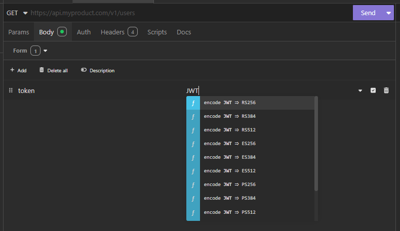
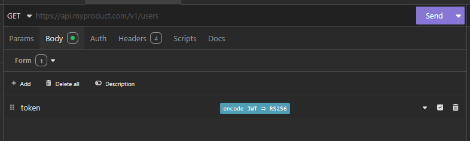
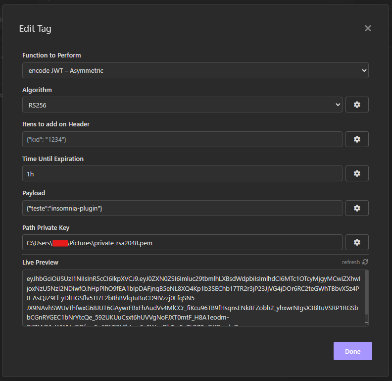
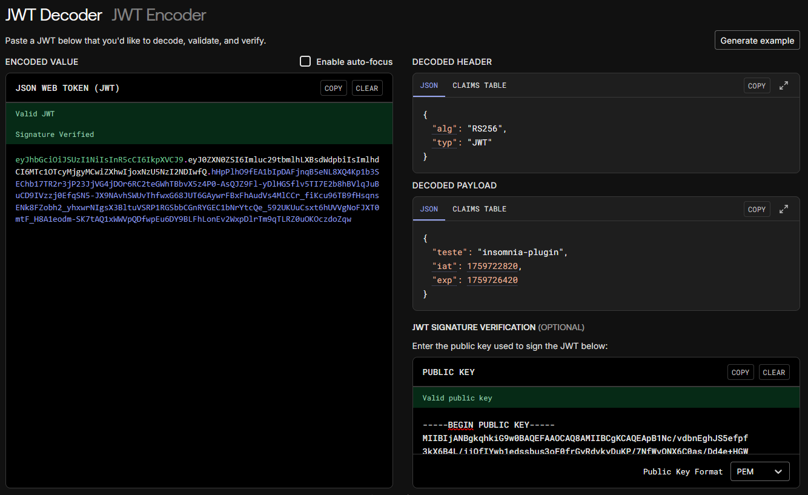
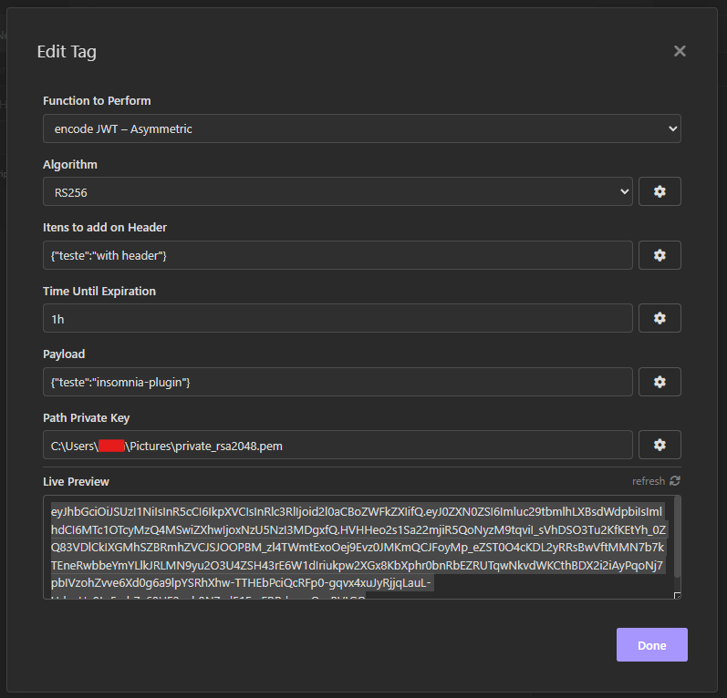
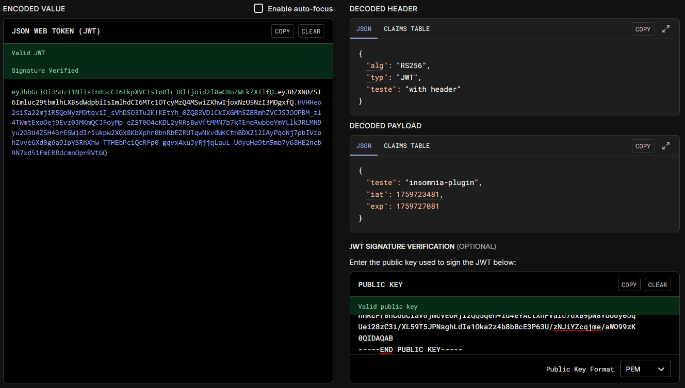
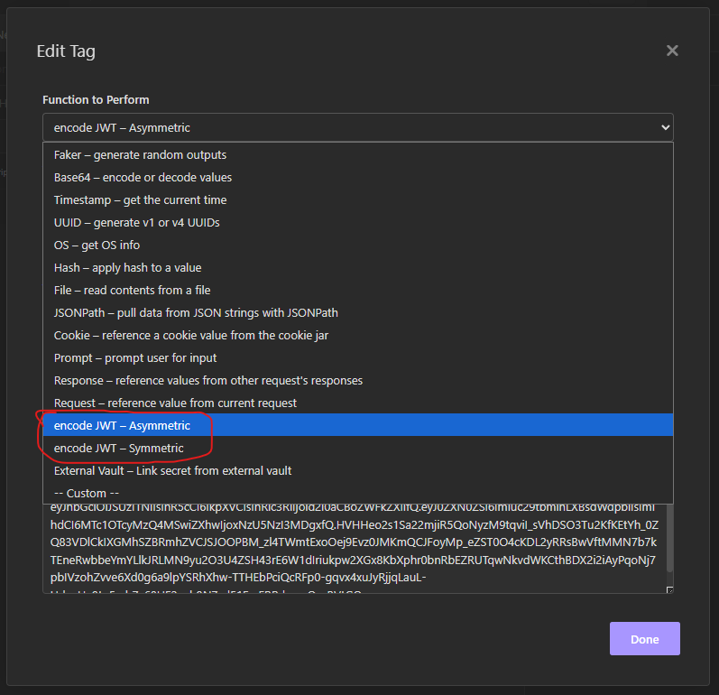
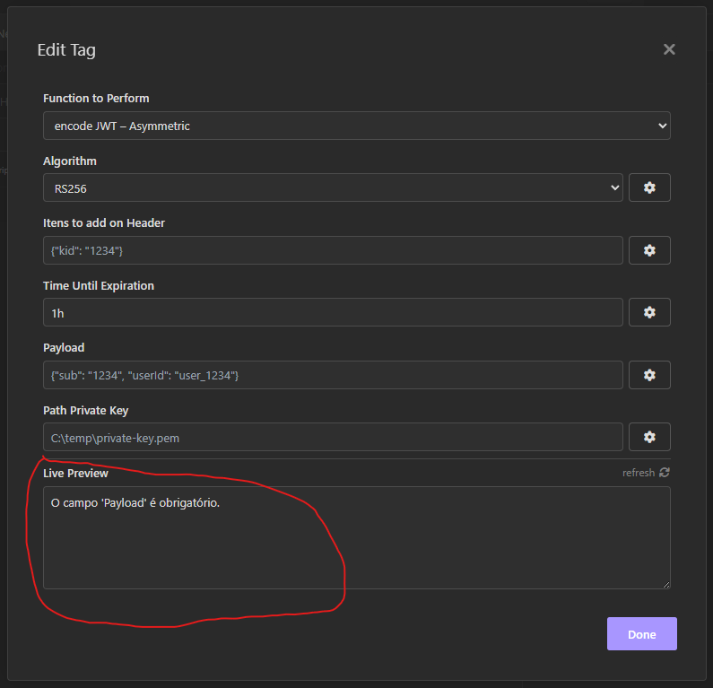

# Insomnia JWT Encoder Plugin

Generate JWT tokens with both symmetric (HMAC) and asymmetric (RSA/ECDSA) algorithms directly in Insomnia.

## Algorithms

- 🔐 **Asymmetric JWT**: Generate JWTs using RSA and ECDSA algorithms
  - RS256, RS384, RS512 (RSA with SHA)
  - ES256, ES384, ES512 (ECDSA)
  - PS256, PS384, PS512 (RSA-PSS)

- 🔑 **Symmetric JWT**: Generate JWTs using HMAC algorithms
  - HS256, HS384, HS512

## Installation

1. Open Insomnia
2. Go to `Application > Preferences > Plugins`
3. Search for `insomnia-plugin-jwt-encoder`
4. Click Install

## Usage

### Getting Started
1. In any Insomnia request field (URL, headers, body, etc.)
2. Press `Ctrl + Space` to open the template tag selector
3. Search for "JWT" to find the JWT template tags
4. Choose between:
   - **🔐 JWT Asymmetric** - for RS/ES/PS
   - **🔑 JWT Symmetric** - for HS

[not showing the options](#dont-appear-options)

### To add information

when you select any option, a tag (blue box) will appear and the text "JWT" ​​will disappear:

After that, you need to click on the tag, and a box will appear. The information you need to enter depends on the chosen algorithm. The tag indicates the selected algorithm type. Note the letters and numbers written in the tag `encode JWT => xxxxx,` where xxxxx is one of the algorithms described in the `Features` section.

#### Asymmetric JWT

1. check the algorithm selected.
2. Add any additional fields you want in the header, in addition to `alg` and `typ`. If you don't add anything, it will only be the two fields.
3. Set expiration time (e.g., "1h", "30m", "7d")
4. Add your payload (JSON format), without the `exp` attribute
5. Specify path to your private key file (.pem)

##### Exemple:

###### without custom headers

###### with custom headers

#### Symmetric JWT
1. check the algorithm selected.
2. Add any additional fields you want in the header, in addition to `alg` and `typ`. If you don't add anything, it will only be the two fields.
3. Set expiration time (e.g., "1h", "30m", "7d")
4. Add your payload (JSON format), without the "exp" attribute
5. Enter your secret key (string or Base64) (Auto-detect Base64 encoded secrets)

### Important

1. Only the `header` section is optional.
2. You can put this tag in ony tab of insomnia.
3. You can only see the algorithm options for the type you are using. If you are using asymmetric algorithms and want to switch to symmetric algorithms, change the `function to perform` option.

4. If any important information is missing, the "Live Preview" section will display messages for you.

### Possible problems

#### don't appear options:
Look in the `Application > Preferences > Plugins` if `insomnia-plugin-jwt-encoder` appears in the section `Plugins` with green check.